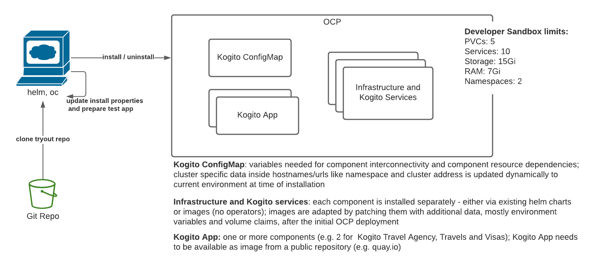

# Kogito Try-out installation
The goal of this procedure is to simplify the deployment of an existing Kogito application on the Openshift platform.
This deployment includes both the required infrastructure and the Kogito application.

* The reference application is taken from [Kogito Travel Agency (extended)](https://github.com/kiegroup/kogito-examples/blob/stable/kogito-travel-agency/extended) 
* Few customizations might be needed to integrate with the deployed infrastructure, as detailed [here](#application-properties)
* The deployment is based on pre-built container images of the Kogito applications, according to the [instructions](#prepare-application-image) 
* The reference version of the Kogito platform is `1.14.0.Final`

## Prerequisites
- [Developer sandbox ](https://developers.redhat.com/developer-sandbox/get-started)  or other Openshift cluster
- oc cli installed
- helm 3 cli installed

### Installable Infrastructure
- Infinispan via helm chart
- Kafka via helm chart
- jboss/keycloak image (in progress)

### Installable Kogito services
- Installed version: 1.14.0  
**Note**: because of Developer Sandbox resource limits the mandatory keycloak authentication for the Management Console in version 1.14.0 cannot be installed here 
=> must use Management Console version 1.8.0 for Developer Sandbox installation (set installer property: KOGITO_MANAGEMENT_CONSOLE_VERSION)
The same applies for the Task Console service.  
If installing on an OCP lab without these limitations, also choose keycloak as installable component and set KOGITO_MANAGEMENT_CONSOLE_VERSION to KOGTIO_VERSION
- Data Index for Infinispan from image
- Management console from image
- [Jobs service](https://docs.jboss.org/kogito/release/latest/html_single/#con-jobs-service_kogito-configuring) from image
- [Task console](https://docs.jboss.org/kogito/release/latest/html_single/#con-task-console_kogito-developing-process-services) from image

## Constraints
- Developer Sandbox does not allow to install additional operators - (https://www.youtube.com/watch?v=oDqw8aBGDD8 from 18.02.2021 - time: 9:09)
  => cannot use Kogito Operator install
- Developer Sandbox imposes resource limits on the user created cluster: 
  - PVCs: 5
  - Services: 10
  - Storage: 15Gi
  - RAM: 7Gi
  - Namespaces: 2

## Architecture 


## Installation
- [prepare the Kogito application](#prepare-kogito-application)
- login to OCP cluster: `oc login ...`
- switch to project: `oc project "your project"`
- update `./installer.properties`
- run `./installer.sh`

## Removal of installation
- login to OCP cluster: `oc login ...`
- switch to project: `oc project "your project"`
- update `./installer.properties`
- run `./uninstaller.sh`

## Prepare Kogito application

### Prepare application image
Description uses kogito example `Kogito-Travel-Agency`
- Copy the properties required by the services and infrastructures that the Kogito application uses, 
into the `application.properties` file.
Properties are listed [below](#application-properties) per component. The following steps are described to build the image of
the [Travels](https://github.com/kiegroup/kogito-examples/blob/stable/kogito-travel-agency/extended/travels/) application:
- build the application: `mvn clean package`  
- build the image: `docker build -f src/main/docker/Dockerfile.jvm -t quarkus/kogito-travel-agency-travels-jvm .`  
- log into a image repository: `podman login quay.io`
- tag the local image for your chosen remote repository:
  `docker tag $(docker images | grep quarkus/kogito-travel-agency-travels-jvm | awk '{printf $3}') quay.io/uegozi/kogito-travel-agency-travels-jvm:1.0.0` 
- push the tagged image: `docker push quay.io/uegozi/kogito-travel-agency-travels-jvm:1.0.0`

The same steps must be repeated for the [Visas](https://github.com/kiegroup/kogito-examples/blob/stable/kogito-travel-agency/extended/visas)
application, or adapted to match the target application.

### Prepare application image installation
- copy domain svgs for the Kogito management console into the `./testapp/svg` folder 
(they are located under `target/classes/META-INF/processSVG/*`)
- copy protobuf files for Kogito data index to the `./testapp/protobuf` folder 
(they are located under `target/classes/META-INF/resources/persistence/protobuf/*.proto`)
- update `./testapp/testapp.sh` and any needed patch yaml files

### Installation of Kogito application
The application is installed together with the complete infrastructure 
when running the `./installer.sh`. 

To install the application separately, run `./testapp/testapp.sh install`

### Removal of Kogito application
The application is uninstalled together with the complete infrastructure
when running the `./uninstaller.sh`. 

To uninstall the application separately, run `./testapp/testapp.sh uninstall`

### Application Properties
Application properties defined in the Kogito examples define usually values for running in a local environment
They can be overridden by environment variables - see [Quarkus Config Reference](https://quarkus.io/guides/config-reference#environment-variables)

#### Infinispan
without authentication:
```
quarkus.infinispan-client.server-list=localhost:11222
quarkus.infinispan-client.use-auth=false
```
with authentication:
```
quarkus.infinispan-client.server-list=localhost:11222
quarkus.infinispan-client.use-auth=true
quarkus.infinispan-client.auth-server-name=infinispan
quarkus.infinispan-client.auth-realm=default
quarkus.infinispan-client.auth-username=
quarkus.infinispan-client.auth-password=
quarkus.infinispan-client.sasl-mechanism=DIGEST-MD5
```
#### Kafka 
```
kafka.bootstrap.servers=localhost:9092
```
#### Kogito Data-Index
```
kogito.dataindex.http.url=http://localhost:8180
kogito.dataindex.ws.url=ws://localhost:8180
```

## Validating Data index
Browse to Data index route and copy below query into GraphiQL query area 
```
{ProcessInstances {id}}
```
## Validating Infinispan
Browse to Infinispan route, use user developer to login; take the password from the infinispan opaque secret

## Validating Kafka topics
You can optionally run the following commands to deploy a new `kafka-client` Pod to verify the events sent to the
Kafka topics:

```shell
kubectl run kafka-client --restart='Never' --image docker.io/bitnami/kafka:2.8.1-debian-10-r57 --namespace dmartino-test --command -- sleep infinity
kubectl exec --tty -i kafka-client --namespace dmartino-test -- bash
kafka-topics.sh --bootstrap-server kafka.dmartino-test.svc.cluster.local:9092 --list
```
The following are sample commands that you can use on the `kafka-client` shell to monitor some of the relevant topics:
```shell
kafka-console-consumer.sh  --bootstrap-server kafka.dmartino-test.svc.cluster.local:9092 --topic kogito-processinstances-events --from-beginning
kafka-console-consumer.sh  --bootstrap-server kafka.dmartino-test.svc.cluster.local:9092 --topic visaapplications --from-beginning
kafka-console-consumer.sh  --bootstrap-server kafka.dmartino-test.svc.cluster.local:9092 --topic visasresponses --from-beginning
```

## Suggestions

